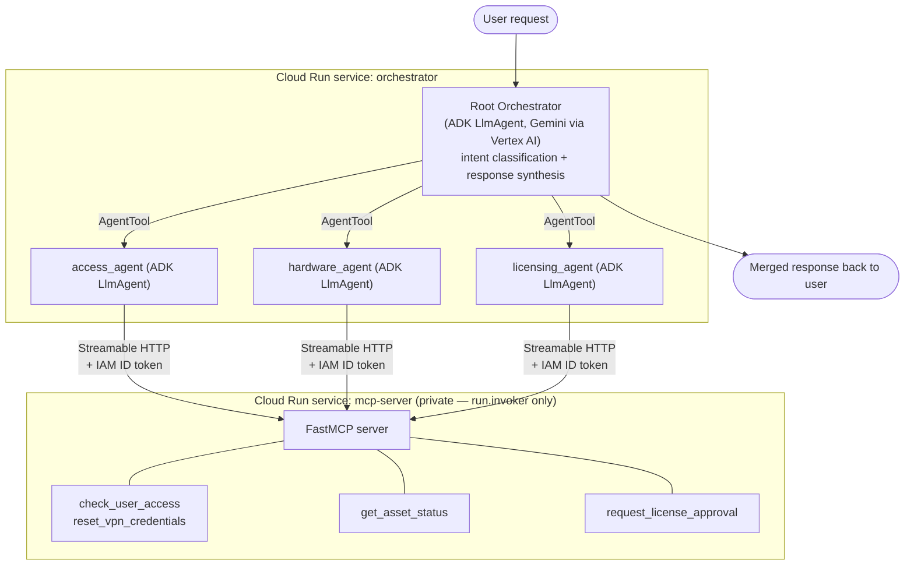

# Architecture

## Why this shape

**Root Orchestrator uses `AgentTool`, not `sub_agents`/transfer.** ADK's
`sub_agents=` + `transfer_to_agent` pattern hands the entire turn's control
to one sub-agent at a time; the parent doesn't get control back to combine
results. That's fine for a pure dispatcher, but it doesn't fit the
assignment's actual requirement: a single request that spans two domains
(e.g. "my VPN is broken **and** I need Adobe licensed") has to invoke two
specialists and come back to one merged answer. Wrapping each specialist in
`AgentTool` lets the root call any subset of specialists, in any order,
within the same turn, and then compose the final response itself. This is
the one non-obvious architectural decision in the system and it's the thing
"multi-agent fan-out" hinges on — see `it_triage_orchestrator/agent.py`.

**Three specialists, not more.** Access, Hardware, and Licensing map
directly to the three domains named in the assignment and to genuinely
different tool surfaces and failure modes. Nothing in the routing logic
needs a fourth agent, so there isn't one — adding one would just be surface
area to explain in the walkthrough for no routing benefit.

**Each specialist gets its own `McpToolset` with a `tool_filter`,** rather
than one shared toolset handed to all three agents. `access_agent` can only
ever see `check_user_access`/`reset_vpn_credentials`; `hardware_agent` can
only see `get_asset_status`; `licensing_agent` can only see
`request_license_approval`. This is enforced in code (see
`it_triage_orchestrator/mcp_client.py` and each `sub_agents/*.py`), not just
implied by the prompt — an agent can't be talked into calling a tool outside
its domain.

**MCP server is a real, separate Cloud Run service**, built with the
official `fastmcp` SDK, speaking Streamable HTTP — not an in-process
function pretending to be MCP. It has no auth logic of its own; Cloud Run's
IAM layer rejects unauthenticated requests before they reach the container
(the service is deployed with `--no-allow-unauthenticated`, and only the
orchestrator's own service account is granted `roles/run.invoker`). That's
the "proper IAM, not shared secrets" requirement satisfied at the
infrastructure layer instead of reimplemented in application code.

**Tool failure handling.** Every tool raises `fastmcp.exceptions.ToolError`
for its failure mode (unknown resource, unknown user, deactivated account,
asset not found, uncatalogued software) instead of crashing or returning a
malformed payload. Each specialist's instruction explicitly tells it to
surface a `ToolError` as a plain-language explanation with a next step,
rather than retrying blindly or inventing a result. `licensing_agent`
additionally treats `denied`/`pending_manager_review` as normal *business*
outcomes (structured data, not exceptions) — a license request being denied
isn't a system failure, and conflating the two would make the agent's
language misleading.

## Request flow examples

- **Single-domain**: "I can't access the shared drive" → root calls
  `access_agent` → `access_agent` calls `check_user_access` → root relays
  the result.
- **Multi-domain fan-out**: "My VPN is broken and I need Figma approved" →
  root calls `access_agent` (→ `reset_vpn_credentials`) **and**
  `licensing_agent` (→ `request_license_approval`) → root merges both
  outcomes into one response, organized by topic.
